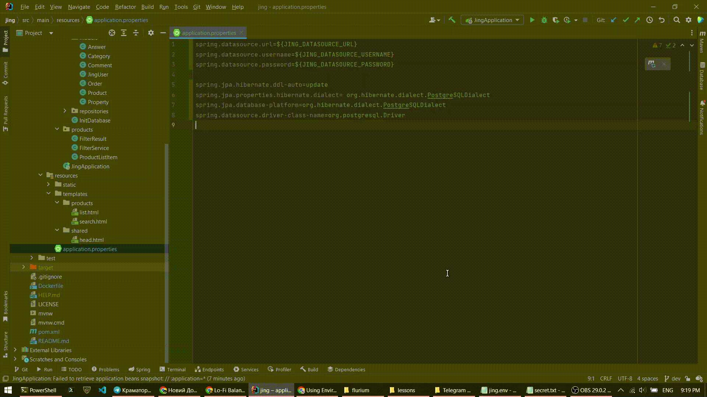

# JING

Java reincarnation of selling platform made with honor in 1 week.  Officially DEAD

Date: Apr 29, 2023 - never

GitHub repo: [flurium/jing](https://github.com/flurium/jing)

Website: [jing.hop.sh](https://jing.hop.sh)

Technical requirements: [docs/tech-requirements](./docs/tech-requirements.md)

### Technologies:

- Java
- Spring Boot
- PostgreSQL
- Mirabo css

### Plan for infrastructure:

- Hop.io for deployment
- CockroachDb for database

## Environment variables setup guide

